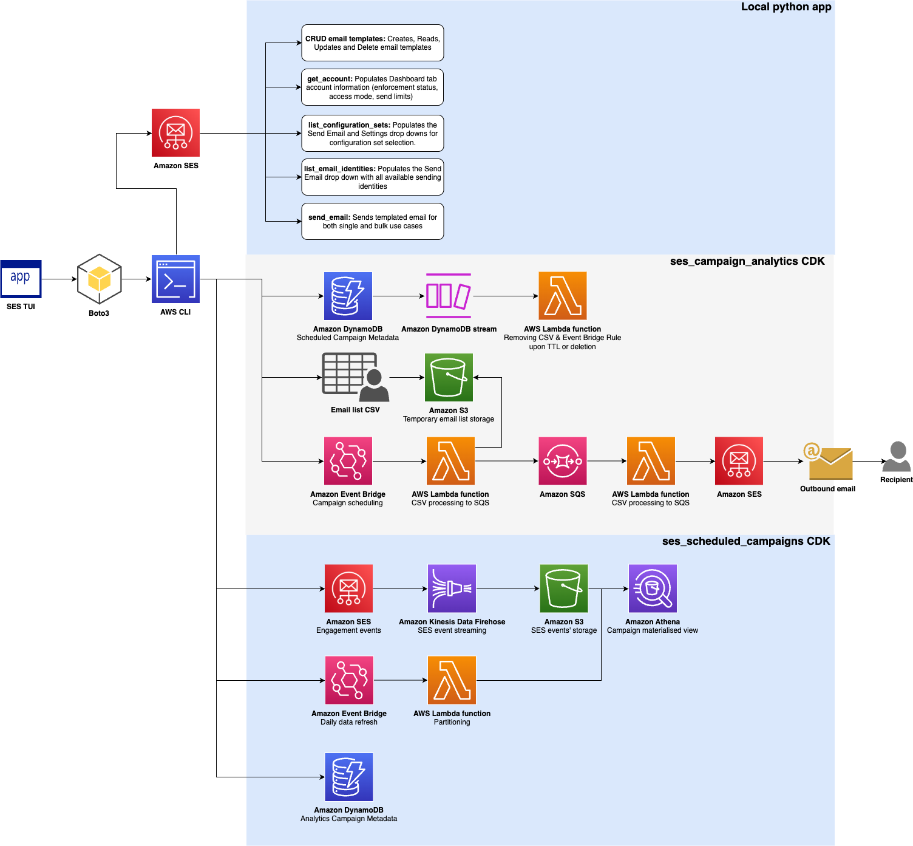

# Amazon SES Campaign Manager

A locally-running terminal interface for managing AWS Simple Email Service at scale. Designed for developers, marketers, and DevOps teams who need to manage email campaigns using Amazon SES. Runs entirely on your local machine using your existing AWS CLI credentials - no web hosting or new credentials needed. Provides a unified interface for the complete email campaign lifecycle instead of switching between AWS Console, CLI commands, and custom scripts.

## Demo


## Architecture



The diagram above shows how the three components work together:
- **Amazon SES Campaign Manager** - Local terminal application for immediate campaign management
- **[Scheduled Campaigns](./ses_scheduled_campaigns/)** - Optional CDK stack for future-dated campaigns
- **[Campaign Analytics](./ses_campaign_analytics/)** - Optional CDK stack for detailed metrics and reporting

**No AWS Deployment Required**: You can use the core functionality immediately without deploying anything to your AWS account. The base application provides template management, single/bulk email sending with rate limiting, and high-level analytics using CloudWatch metrics.

**Optional Cloud Features**: Two CDK stacks are available for advanced use cases - see [Optional CDK Stacks](#optional-cdk-stacks) section below.

## Why Amazon SES Campaign Manager

**The Problem**: Sending bulk email campaigns with Amazon SES typically requires either building custom code (time-consuming) or purchasing third-party tools (expensive at scale).

**This Starter Project**: Open source terminal application that runs locally using your AWS CLI credentials. No hosting, no new credentials, minimal cost.

**Key Benefits**:
- ✅ Bulk sending with real-time progress tracking
- ✅ Template management and preview
- ✅ Optional cloud features for scheduling and detailed analytics
- ✅ Learning platform to understand SES before building your own solution
- ✅ Cost: Amazon SES charges apply. See [SES Pricing](https://aws.amazon.com/ses/pricing/) for details
- ✅ Optional cloud features: Estimated pricing varies based on usage (S3, Lambda, DynamoDB, etc.)

## Key Features

### Core Functionality (No Deployment Required)

**Template Management**
- Create, edit, delete SES email templates
- Preview templates in browser to see HTML rendering
- Automatic placeholder detection (e.g., `{{name}}`, `{{company}}`)
- **Recommendation**: Use third-party tools (e.g., Stripo, Unlayer, BeeFree) to design HTML templates, then import here

**Single Email Sending**
- Template-based email composition with auto-populated placeholders
- CC and BCC support
- Configuration Set selection for event tracking
- Custom SES tags for categorization and filtering
- Unsubscribe headers and links (RFC 8058 compliant)

**Bulk CSV Campaigns (Local Execution)**
- CSV-based sending with per-recipient template substitution
- **Automatic CSV validation** on file selection with detailed error reporting
- **Configurable sending rate**: Set emails per second (respects Amazon SES MaxSendRate)
- **Campaign metadata**: Name, description, creator (stored in DynamoDB if analytics stack deployed)
- Real-time progress tracking with pause/resume/cancel controls
- **Rate limiting**: Semaphore-based throttling for immediate sending
- **Retry logic**: Exponential backoff for transient errors
- Results exported to CSV with success/failure details

**CSV Validation**
- **Immediate validation** when browsing/selecting CSV files
- **Template variable matching**: Validates CSV columns match email template variables
- **Blocking errors** prevent sending until fixed:
  - Missing or invalid file
  - File size exceeds 50MB
  - Missing required `To_Address` column
  - Invalid email formats
  - Empty substitution variables (prevents rendering failures)
  - **Template variable mismatch**: Missing or extra substitution columns vs template
  - Empty CSV file
  - Exceeds 50,000 row limit
- **Non-blocking warnings** allow sending but should be reviewed:
  - Duplicate email addresses
  - No substitution columns found
  - Empty or duplicate column names
- **System variables excluded**: Unsubscribe links automatically managed, no CSV columns needed
- **Validation report**: View all errors/warnings in popup modal or save to file
- **Summary notifications**: Quick status without flooding the UI

**High-Level Analytics (CloudWatch)**
- View sends, deliveries, opens, clicks, bounces, complaints
- Configurable time periods (1h to 30 days)

**Settings Management**
- **AWS Configuration**: Switch between AWS profiles and regions
- **Debug Logging**: Enable verbose logging to log file for troubleshooting
- **Default Configuration Set**: Set default config set for event tracking
- **Retry Settings**: Configure exponential backoff parameters (max retries, base delay)
- **Unsubscribe Configuration**: 
  - Landing page and API endpoint URLs
  - Encryption key generation (Fernet) for email address security
  - Topic-based unsubscribe categories (e.g., "newsletter", "promotions")
  - Support for email body links and/or List-Unsubscribe headers
- **Cache Management**: View cached files and invalidate when needed

### Optional Advanced Features (Require CDK Deployment)

**Scheduled Campaigns** (Deploy [ses-scheduled-campaigns](./ses_scheduled_campaigns/README.md) stack)
- Schedule bulk CSV campaigns for future execution (days/weeks in advance)
- **Rate limiting**: SQS queue with backpressure mechanism
- **Retry logic**: Transient errors (e.g., throttling) written back to SQS, permanent errors to DLQ
- **Sending mechanism**: SQS batching + Lambda concurrency for maximum TPS without exceeding quota
- No need to keep TUI running - execution happens in AWS Lambda
- View and delete upcoming scheduled campaigns
- Automatic cleanup of CSV and EventBridge Rule 1 hour after execution (TTL-based)

**Campaign Analytics** (Deploy [ses-campaign-analytics](./ses_campaign_analytics/README.md) stack)
- Detailed performance tracking with Kinesis Firehose + Athena
- Cost-efficient queries on materialized views (Parquet in S3)
- Campaign metadata enrichment (name, description, creator, template)
- Date range filtering with campaign-specific drill-down
- Hide/unhide campaigns (soft delete) for organized view management

## How It Works

### Local Execution
```
Your Machine → AWS CLI Credentials → Amazon SES API
     ↓
  Terminal UI (Textual/Python)
```

- Application runs in your terminal
- Uses boto3 with your AWS CLI credentials
- No web server, no hosting, no new credentials

### Architecture Highlights

**Rate Limiting**
- **Local (Immediate)**: Semaphore-based concurrent task limiting. Set to 85-90% of AWS MaxSendRate to account for async efficiency (~10-15% boost in actual TPS)
- **Scheduled (Cloud)**: SQS queue with Lambda concurrency controls. Backpressure mechanism prevents overwhelming SES. Formula: Reserved Concurrency × 20 = Target TPS. 20 is a rough estimate of number of SendEmail SES API calls can be done in 1 second.

**Retry Logic**
- **Local (Immediate)**: Exponential backoff with configurable max retries (0-10) and base delay (0.1-10s). Throttling errors use 2× base delay
- **Scheduled (Cloud)**: Transient errors (throttling, service unavailable) written back to SQS for retry. Permanent errors sent to DLQ. Uses SQS batching and Lambda concurrency for optimal throughput

**Progress Tracking**
- **Local (Immediate) only**: Real-time progress bar, pause/resume/cancel controls, live statistics (success/fail/throttled counts)
- **Scheduled (Cloud)**: No progress tracking in TUI (executes in Lambda). Monitor via CloudWatch logs

**Caching Layer**
- File-based JSON cache with configurable TTL per operation
- **Critical for Amazon SES**: Management APIs limited to 1 TPS (e.g., list_configuration_sets, get_templates)
- Prevents hitting rate limits during normal usage
- TTL examples: Templates (30 min), Account details (60 min), Metrics (5 min)
- Manually invalidate from Settings tab if needed

**CSV-Based Bulk Sending**
- **Local (Immediate)**: Select CSV file via file browser, configure rate, add metadata, monitor progress in TUI
- **Scheduled (Cloud)**: Upload CSV to S3, create DynamoDB entry with TTL, EventBridge triggers execution
- Both modes: CSV format with `To_Address` column + template substitution columns (`sub_name` → `{{name}}`)

**Unsubscribe Handling**
- **Two modes**: Email body links ({{unsubscribe_link}} placeholder) and/or List-Unsubscribe headers
- **Topic support**: Categorize unsubscribes (e.g., "newsletter", "promotions")
- **Encryption**: Email addresses encrypted with Fernet before including in URLs
- **User implementation required**: You must build the landing page and API endpoint to process unsubscribes

## Prerequisites

Before getting started, ensure you have:

- Python 3.8 or higher installed
- AWS CLI installed and configured with credentials
- Amazon SES account with:
  - At least one verified identity (email address or domain)
  - Configuration set created (optional but recommended for event tracking)
  - Production access enabled if sending to non-verified addresses
- Basic familiarity with Amazon SES concepts

For detailed setup instructions, see the [Installation Guide](docs/INSTALLATION.md).

## Quick Start

### Local TUI Setup

```bash
# Clone and install
git clone <repository-url>
cd ses_tui
python3 -m venv venv
source venv/bin/activate
pip install -r requirements.txt

# Run (validates setup first)
chmod +x run_modular.sh
./run_modular.sh
```

**First Run**: Select AWS profile and region. Configuration saves to `config/settings.json`.

**See**: [Installation Guide](docs/INSTALLATION.md) for detailed setup, configuration, and troubleshooting.

### Optional CDK Stacks

Deploy these stacks for advanced features:

**Scheduled Campaigns** - Schedule bulk campaigns for future execution:
```bash
cd ses_scheduled_campaigns
npm install
# Edit config.json (set sendingRateTPS, notificationEmail, etc.)
cdk deploy
```
**See**: [ses_scheduled_campaigns/README.md](./ses_scheduled_campaigns/README.md)

**Campaign Analytics** - Track detailed campaign performance:
```bash
cd ses_campaign_analytics
npm install
# Edit config.json (set notificationEmail, etc.)
cdk deploy
```
**See**: [ses_campaign_analytics/README.md](./ses_campaign_analytics/README.md)

## Documentation

- **[Installation Guide](docs/INSTALLATION.md)** - Local setup, configuration, optional CDK stacks, troubleshooting
- **[Features Guide](docs/FEATURES.md)** - Detailed feature descriptions, UI walkthroughs, technical mechanics
- **[Usage Guide](docs/USAGE.md)** - Step-by-step instructions, best practices, workflow examples

## Optional CDK Stacks

Deploy these stacks for advanced features. Each has its own detailed README:

- **[Scheduled Campaigns](./ses_scheduled_campaigns/README.md)** - EventBridge, SQS, Lambda for future-dated campaigns
- **[Campaign Analytics](./ses_campaign_analytics/README.md)** - Kinesis Firehose, Athena, Glue for detailed metrics
